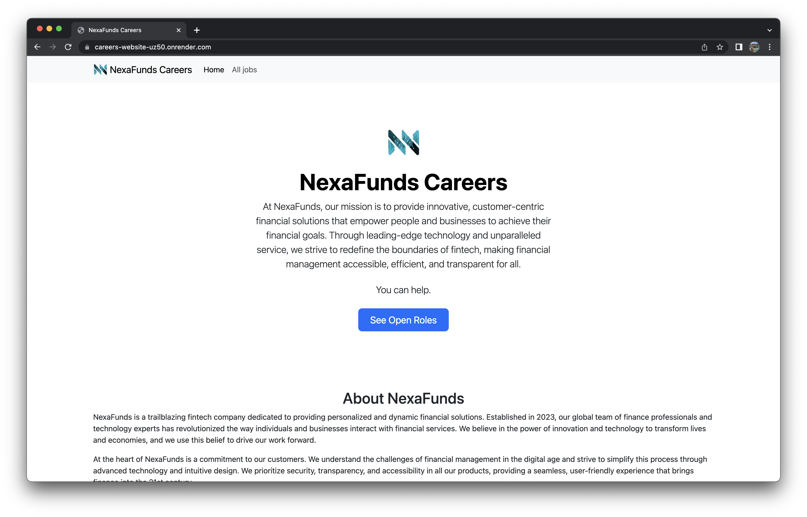

# Nexa Funds Careers

The website is available on [Render](https://careers-website-uz50.onrender.com):

## What is this?

This is a tiny web application I built to learn the basics of Flask. It's a
careers website for a fictive company, Nexa Funds - a fintech that "innovative,
customer-centric financial solutions that empower people and businesses to
achieve their financial goals".

## Is this company real?

Nope. It was created by ChatGPT - my prompt was:

> I need a fictive company in the fintech space. Generate a name, tagline,
> mission and vision statements, three paragraphs copy for the "about us" page,
> and provide me with a Dall-E prompt that would generate the logo of the
> company.

This is what I got back:

> Company Name: NexaFunds

> Tagline: Empowering Financial Futures

> Mission Statement: At NexaFunds, our mission is to provide innovative,
> customer-centric financial solutions that empower people and businesses to
> achieve their financial goals. Through leading-edge technology and
> unparalleled service, we strive to redefine the boundaries of fintech, making
> financial management accessible, efficient, and transparent for all.

> Vision Statement: We envision a world where finance is no longer complicated
> or intimidating. Our vision is to become the leading financial technology
> firm globally, driving the transformation towards seamless, inclusive, and
> sustainable finance. We aim to bridge gaps, exceed boundaries, and lead in
> fintech innovation to improve the lives of individuals and the success of
> businesses worldwide.

> About Us:
> NexaFunds is a trailblazing fintech company dedicated to providing
> personalized and dynamic financial solutions. Established in 2023, our global
> team of finance professionals and technology experts has revolutionized the
> way individuals and businesses interact with financial services. We believe
> in the power of innovation and technology to transform lives and economies,
> and we use this belief to drive our work forward.
>
> At the heart of NexaFunds is a commitment to our customers. We understand the
> challenges of financial management in the digital age and strive to simplify
> this process through advanced technology and intuitive design. We prioritize
> security, transparency, and accessibility in all our products, providing a
> seamless, user-friendly experience that brings finance into the 21st century.
>
> Beyond our cutting-edge technology, what sets NexaFunds apart is our
> dedication to social responsibility. We believe that finance should be
> inclusive and equitable, and we're devoted to breaking down barriers and
> creating opportunities. We invest in our communities and use our platform to
> promote financial literacy and inclusivity, driving change within and beyond
> the fintech industry.

> Dall-E Prompt: "Logo of a modern, innovative fintech company named NexaFunds, incorporating elements of finance, technology, and future. Use a color scheme of blue and silver to represent trust, reliability, and forward-thinking."

## What is the stack?

Python, Flask, SQLAlchemy, and a bunch of other Python libraries. See `requirements.txt` for more details.

The databse is powered by PlanetScale. It's deployed on Render.
